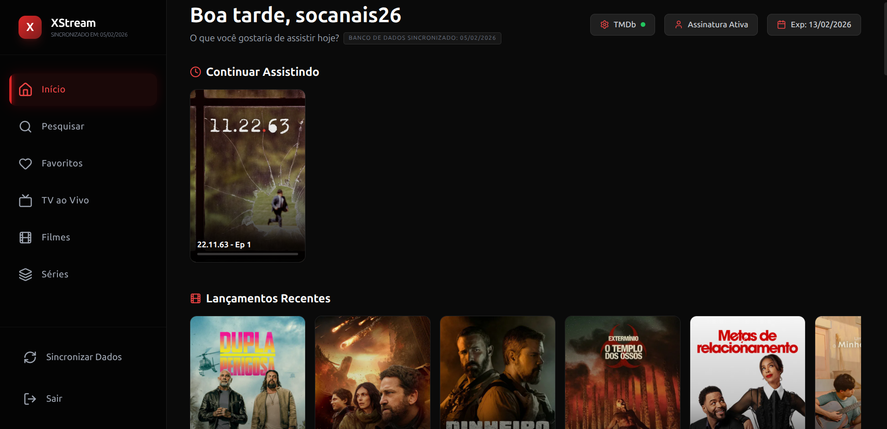

# Xstream Player



A modern web application for IPTV content playback via Xstream Codes API, built with Next.js and React.

## ⚠️ IMPORTANT SECURITY WARNING

**THIS APPLICATION IS INTENDED FOR PRIVATE NETWORK USE ONLY.**

*   **Do not expose this application directly to the internet.**
*   The application **does not have robust security checks** implemented.
*   IPTV account information (host URL, username, and password) is **saved locally unencrypted** on the server (in the `data/config.json` file).
*   Use only in controlled and secure environments is recommended.

---

## � Motivation

The idea for this project arose from the limitations found in various IPTV apps across different TV brands and devices. Some of the main problems encountered were:

*   **Repetitive Login:** The need to connect the IPTV account individually on each TV.
*   **Lack of Synchronization:** Impossible to stop watching content in the living room and continue from the exact same point in the bedroom.
*   **Poor User Experience:** Most IPTV players are filled with advertisements, require payment, or simply deliver a subpar interface.
*   **Lack of Discovery:** Absence of a dynamic experience with content suggestions based on the available library.

This project aims to solve these issues by providing a centralized, modern, and ad-free web interface.

## �📺 Features

*   Xstream Codes API Support.
*   Modern and responsive interface.
*   Local data persistence for easy access.
*   Playback of live channels, movies, and series (VOD).
*   TMDB integration for rich metadata (posters, overviews, ratings) and daily suggestions.
*   "Continue Watching" functionality to resume content from where you left off.

## 🚀 How to Install and Run

### Prerequisites

*   Node.js (v18 or higher)
*   npm or yarn

### Local Installation

1.  Clone the repository or download the files.
2.  In the terminal, access the project folder.
3.  Install dependencies:
    ```bash
    npm install
    ```
4.  Start the development server:
    ```bash
    npm run dev
    ```
5.  Access `http://localhost:3000` in your browser.

### Docker

1.  Build the image:
    ```bash
    docker build -t xstream-player .
    ```

2.  Run the container with data persistence (essential for saving login):
    ```bash
    docker run -d \
      -p 3000:3000 \
      -v $(pwd)/data:/app/data \
      --name xstream-player \
      xstream-player
    ```

    Or if you prefer to use the Docker Hub image (if available):
    ```bash
    docker run -d \
      -p 3000:3000 \
      -v $(pwd)/data:/app/data \
      --name xstream-player \
      jandersonss/xstream-player:latest
    ```

## 💾 Data Persistence

The application uses the `/data` folder in the project root to store logged-in account settings (`config.json`).

It is **essential** to bind this volume (`-v $(pwd)/data:/app/data`) to ensure your login data remains persistent after container restart.

### Docker Compose

Example `docker-compose.yml`:
```yaml
services:
  xstream-player:
    image: xstream-player
    build: .
    ports:
      - "3000:3000"
    volumes:
      - ./data:/app/data
```

### ⚠️ Important (Linux Users)

If you are running on Linux, you may face permission issues (`EACCES: permission denied`), as the container user (`uid 1001`) is different from your local user.

To fix this, you need to adjust permissions for the `data` folder on your local machine:

```bash
# Option 1: Give write permission to "others" (easier)
chmod -R 777 data/

# Option 2: Assign ownership to the container uid (more secure)
sudo chown -R 1001:1001 data/
```

## 🛠️ Technologies Used

*   [Next.js](https://nextjs.org/)
*   [React](https://reactjs.org/)
*   [Tailwind CSS](https://tailwindcss.com/)
*   [HLS.js](https://github.com/video-dev/hls.js/)
*   [Framer Motion](https://www.framer.com/motion/)
*   [Lucide React](https://lucide.dev/)

---

## Donations

**In cryptocurrencies:**

**EVM Networks (ETH, BNB, Arbitrum, Optimism, etc.):**
`0x67270c1e57bdcc888331198e79f001de7b8a7e88`

**Solana:**
`4q4LufXBtvvRo4Rc3YfJMhXwagkqiwzJmBbYkZWrJ4ja`

**BTC:** `bc1qz6kjajch0efkc827sal0mncvzam6njjqsfjh3q`

**Pix:** `2e204859-2190-4147-b97f-6d141cbdf324`
